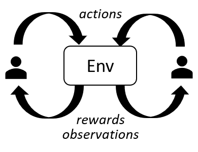

# Research Journal
###### **Demetrius Davis**, Virginia Tech (VT), Computer Science *[last update: November 2020]*

My current dissertation research is strongly focused on the application of one or more cyber deception techniques to augment
insufficient network defense resources. A number of features are added to the agent, network and node models to closely
emulate real-life attack-defend scenarios.

## Research Journal Sections
* [Research Overview ("The Big Idea")](#the-big-idea)
* [Research Challenges](#research-challenges)
  * [Policy Convergence in Multi-Agent Scenarios](#policy-convergence-in-multi-agent-scenarios)
  * [Example MADRL Solutions](#example-madrl-solutions)
  * [Representations for Agent-Specific Observations](#representations-for-agent-specific-observations)
* [Research Updates](#research-updates)
* [Experiment Details](#experiment-details)
  * [MADDPG](#maddpg)
  * [Multi-Agent Particle Environment (MPE)](#multi-agent-particle-environment-mpe)
* [Key Research Literature](#key-research-literature)
  * [Cyber Deception](#cyber-deception)
  * [Reinforcement Learning](#reinforcement-learning)
    * [Multi-Agent Deep Reinforcement Learning](#multi-agent-deep-reinforcement-learning-madrl)
    * [Adversarial Reinforcement Learning](#adversarial-reinforcement-learning)
    * [Gradient Descent](#gradient-descent)
      * [Policy Gradient Descent](#policy-gradient-descent-pgd)
      * [Stochastic Gradient Descent](#stochastic-gradient-descent-sgd)
* [Past Study Topics](#past-studiy-topics)
  * [Game Theoretic Modeling](#game-theoretic-modeling)
  * [Mobile Crowdsensing](#mobile-crowdsensing)
  * [Location Privacy](#location-privacy)

---
## The Big Idea

---
## Research Challenges

### Policy Convergence in Multi-Agent Scenarios
This aspect of my experimentation work has bedeviled me for MONTHS on end. In a nutshell, each agent's policy fails to converge (or "learn) due to changes in the environment that are not directly attributable to the agent's actions. As a result, there is no consistent link between action and reward -- resulting in a perpetually stochastic policy.

*Solution: TBD*

### Example DRL Solutions
TBD

*Solution: TBD*

### Representations for Agent-Specific Observations
TBD

*Solution: TBD*

---
## Research Updates
// 11-19-2020 - Meeting with Prof. Cho
* Progress has been impeded for several months as I have struggled to find a policy-based MADRL solution to the two-player, non-cooperative security game as proposed in my draft paper
* Other studies have documented similar issues with the concurrent training of multiple agents on a common environment
  * Example: [Xia2019] trains two agents using different algorithms (DDPG, DQN) and rewards decisions without applying selected actions to the environment
* The scale and complexity induced by the high number of network nodes, attack types, and defense techniques – in addition to a dynamic network topology – result in stochastic agent policies and an expansive set of potential actions and states
  * MADRL algorithm effectiveness is hampered by *observation→action→reward* inconsistency

* Next Steps:
  * Explore use of DDPG algorithm for single agent (defender) and implement a utility function to drive the attacker's decisions (rebrand the attacker as 'primitive' or unsophisticated)
  * If discernible progress is not achieved in next few weeks, replace DRL approach with a game theoretic model -- a GT approach will impact the 'imperfect information' and 'uncertainty' aspects of the DRL approach.
  * Resume biweekly meetings and post meeting notes -- next meeting is scheduled for 12/3
---
## Experiment Details

### Algorithm: Multi-Agent Deep Deterministic Policy Gradient (MADDPG)
* Online MADDPG resources: [Paper](https://arxiv.org/pdf/1706.02275.pdf), [Github codebase](https://github.com/openai/maddpg)
* Referenced extensively – working examples found for “cooperative” models only
* Network, node, and agent models implemented using MPE, an OpenAI “gym”
* Options to set the learning rate (0.01), discount factor (0.95), and batch size (1024)

### Environment: Multi-Agent Particle Environment (MPE) OpenAI Gym
Online MPE resources: [Github codebase](https://github.com/openai/multiagent-particle-envs)

---
## Key Research Literature
An extensive literature review is necessary to ascertain the latest research advances and identify the thought leaders in a
particular field of study. Hundreds of abstracts, technical papers, conference journals and books have been canvassed across a myriad number of topical areas, with only a select few -- including game-changing, seminal works -- being highlighted here.

### Cyber Deception
Cyber deception. 
- A. Schlenker, et al (2018), [Deceiving Cyber Adversaries: A Game Theoretic Approach](https://dl.acm.org/doi/10.5555/3237383.3237833)
- D. Rawat, et al (2019) [Performance Evaluation of Deception System for Deceiving Cyber Adversaries in Adaptive Virtualized Wireless Networks](https://dl.acm.org/doi/10.1145/3318216.3363377)

#### Moving Target Defense
Per [DHS](https://www.dhs.gov/science-and-technology/csd-mtd#:~:text=Moving%20Target%20Defense%20(MTD)%20is,their%20probing%20and%20attack%20efforts.),
*Moving Target Defense (MTD)* is a popular deception technique which endeavors to "dynamically shift the attack surface" in an effort
to deceive adversaries in real time.

### Reinforcement Learning
*Reinforcement Learning (RL)* is the third branch of Machine Learning (after Unsupervised and Supervised Learning).

My research utilizes several sub-disciplines of this popular data science technique, to include: multi-agent deep RL, adversarial RL, 
Markov Decision Process (MDP) and gradient descent algorithms.

#### Multi-Agent Deep Reinforcement Learning (MADRL)
*Deep Reinforcement Learning (DRL)* is TBD.

*Multi-Agent DRL* (MADRL) is TBD.

- Other Github Survey Sites:
  * [Paper Collection of Multi-Agent Reinforcement Learning (MARL)](https://github.com/LantaoYu/MARL-Papers)
  * [Awesome Multiagent Learning](https://github.com/chuangyc/awesome-multiagent-learning)

#### Adversarial RL
Non-cooperative, or Adversarial, RL is TBD.

- R. Elderman, et al (2017), [Adversarial Reinforcement Learning in a Cyber Security Situation](https://www.semanticscholar.org/paper/Adversarial-Reinforcement-Learning-in-a-Cyber-Elderman-Pater/dd6925f543ce9cb05c8e317c44ece5bf42189999)
- Y. Liu, et al (2019), [Self-Improving Generative Adversarial Reinforcement Learning](https://research.tees.ac.uk/en/publications/self-improving-generative-adversarial-reinforcement-learning)
- L. Pinto, et al (2017), [Robust Adversarial Reinforcement Learning](http://proceedings.mlr.press/v70/pinto17a/pinto17a.pdf)
- W. Uther, M. Veloso (1997), [Adversarial Reinforcement Learning](http://www.cs.cmu.edu/~mmv/papers/03TR-advRL.pdf)
- X. Pan, et al (2019), [Risk Averse Robust Adversarial Reinforcement Learning](https://ieeexplore.ieee.org/document/8794293)
- S. Xia, et al (2019), [An Adversarial Reinforcement Learning Based System for Cyber Security](https://www.semanticscholar.org/paper/Adversarial-Reinforcement-Learning-in-a-Cyber-Elderman-Pater/dd6925f543ce9cb05c8e317c44ece5bf42189999)

### Gradient Descent
[Towards Data Science](https://towardsdatascience.com/gradient-descent-algorithm-and-its-variants-10f652806a3) 
provides a good introduction and overview of gradient descent algorithms.

#### Policy Gradient Descent (PGD)
TBD

#### Stochastic Gradient Descent (SGD)
TBD

### Topology Control
TBD

---
## Past Study Topics
- Game Theoretic Modeling: Before adopting a RL-based approach, my earlier iterations of this study topic involved the use of non-cooperative game theoretic models. I examined several studies that employed Strong Stackelberg Equilibrium (SSE) to analyze attacker-defender network defense scenarios.
- Mobile Crowdsensing
- Location Privacy
